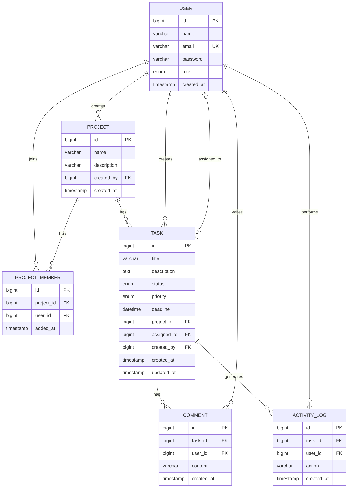

# Chen ER Diagram Specification

Use this as the exact blueprint if you want to redraw the ER diagram with:

- double rectangles not needed because there are no weak entities here
- double lines for total participation
- dashed ovals for derived attributes
- diamonds for relationships

## Important Note

Mermaid cannot draw full Chen notation details like:

- double participation lines
- dashed ovals for derived attributes
- oval attribute nodes

So for submission, viva sheet, or notebook drawing, use [DETAILED_ER_MODEL.md](/Users/bhavjain/Downloads/mini-jira-tracker/docs/DETAILED_ER_MODEL.md) as the authoritative detailed version.
