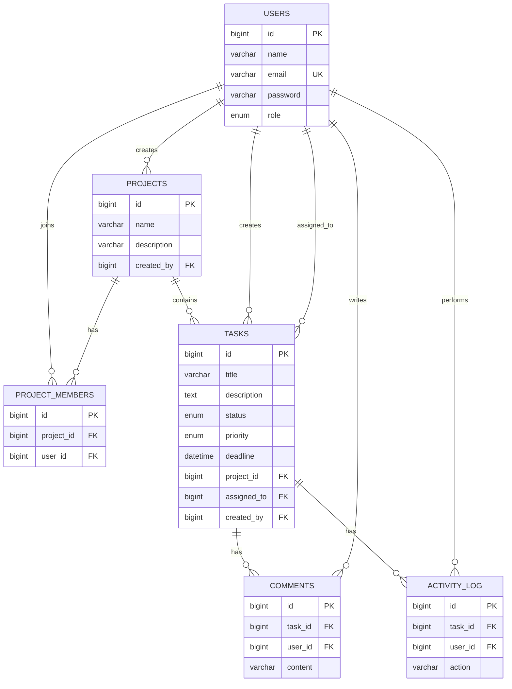

# ER Diagram

```mermaid
erDiagram
    USERS ||--o{ PROJECTS : creates
    USERS ||--o{ PROJECT_MEMBERS : joins
    PROJECTS ||--o{ PROJECT_MEMBERS : has
    PROJECTS ||--o{ TASKS : contains
    USERS ||--o{ TASKS : creates
    USERS ||--o{ TASKS : assigned_to
    TASKS ||--o{ COMMENTS : has
    USERS ||--o{ COMMENTS : writes
    TASKS ||--o{ ACTIVITY_LOG : has
    USERS ||--o{ ACTIVITY_LOG : performs

    USERS {
        bigint id PK
        varchar name
        varchar email UK
        varchar password
        enum role
    }

    PROJECTS {
        bigint id PK
        varchar name
        varchar description
        bigint created_by FK
    }

    PROJECT_MEMBERS {
        bigint id PK
        bigint project_id FK
        bigint user_id FK
    }

    TASKS {
        bigint id PK
        varchar title
        text description
        enum status
        enum priority
        datetime deadline
        bigint project_id FK
        bigint assigned_to FK
        bigint created_by FK
    }

    COMMENTS {
        bigint id PK
        bigint task_id FK
        bigint user_id FK
        varchar content
    }

    ACTIVITY_LOG {
        bigint id PK
        bigint task_id FK
        bigint user_id FK
        varchar action
    }
```
